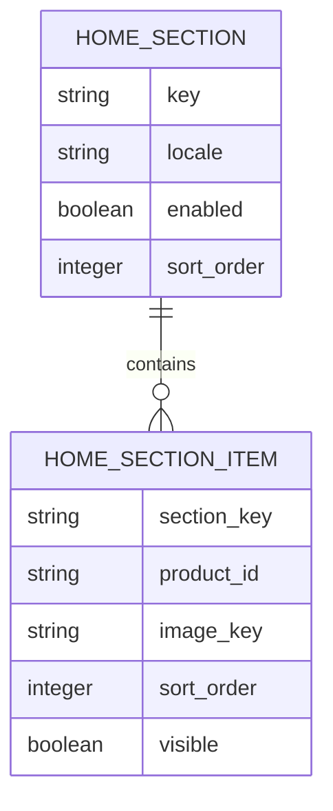
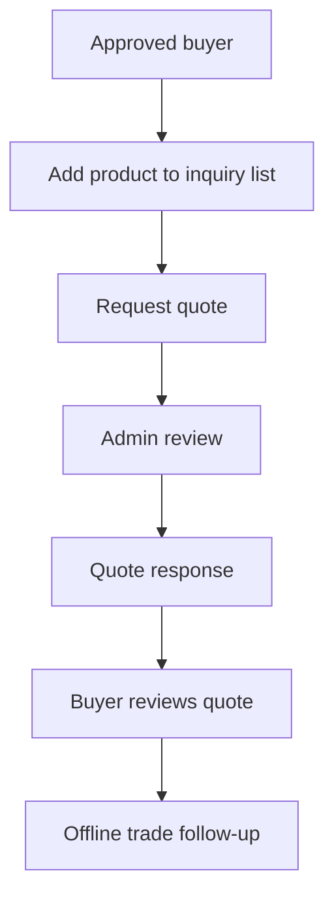

# Noblesse B2B Catalog Roadmap

Date: 2026-07-08

Purpose: convert the current production catalog into an operations-ready B2B wholesale catalog while preserving the quote-request model.

## Principles

- Keep the product flow image-first and premium.
- Keep prices and MOQ gated by buyer approval.
- Keep direct settlement out of the public site.
- Make admin operations explicit instead of relying on hard-coded or fallback content.
- Prefer additive schema and API changes.
- Never expose private runtime configuration in frontend builds.

## Phase 1 - Stabilize Current Production

| Workstream | Goal | Status |
| --- | --- | --- |
| Public route QA | Keep home, product list, detail, register, account, admin routes rendering | In progress |
| Product detail typography | Make KR/EN/JP/TW long copy balanced and readable | Needed |
| Registration locale parity | Match Korean terms/table structure in EN/JP/TW | Needed |
| Header session UX | Keep login state stable across logo/home navigation | Needs regression watch |
| Remove temporary UI | Remove helper/test labels from production UI | Needed |

## Phase 2 - Catalog Data Completeness

| Workstream | Goal | Notes |
| --- | --- | --- |
| Attribute detail editor | Admin can enter material, shape, structure, color, size, and detail copy cleanly | Next recommended task |
| Product images | Keep object metadata in DB and binary assets in storage | Existing image path present |
| Product option structure | Normalize finish, size, color, and variant attributes | Required before richer inquiry flows |
| Category and taxonomy editor | Manage category, material, shape, and filter labels from admin | Needed |
| Empty section behavior | Disable or hide empty home sections until assigned content exists | Needed |

## Phase 3 - Home Editorial Operations

| Home area | Admin capability |
| --- | --- |
| Snap / hero cards | Upload/select image, title, label, link, sort, visible state |
| New arrivals | Assign products or auto from recent products, with enable/disable |
| Weekly pick | Assign products, editorial text, enable/disable |
| Buyer selection | Assign products/collections for buyer-specific editorial blocks |
| Piercing | Map taxonomy-driven product groups |
| Steady selection | Curate steady-selling products |

Recommended model:

## Phase 4 - Buyer and Admin Operations

| Workstream | Goal |
| --- | --- |
| Buyer management UX | One card per member with buyer state, account state, discount class, and operator actions |
| Operator role assignment | Owner can appoint operators and assign permissions safely |
| Inquiry management | Admin can review buyer inquiries and change workflow states |
| Quote management | Admin can create/send quote responses from inquiry data |
| Audit clarity | Important admin changes are visible in audit logs |

Buyer lifecycle should separate:

| Dimension | Values |
| --- | --- |
| Account state | Active, withdrawn, removed |
| Buyer review state | Draft, pending, approved, rejected, suspended, blocked |
| Admin role | Owner, operator, none |

## Phase 5 - Inquiry and Quote MVP

Needed:

| Feature | Notes |
| --- | --- |
| Multi-product inquiry | Use Inquiry List as the source |
| Quantity and option capture | Keep product option data structured |
| Admin quote response | Respond with price, availability, lead time, and notes |
| Buyer history | My Inquiries shows submitted and responded requests |
| Status labels | Quote Requested, Under Review, Quote Sent, Closed, Cancelled |

## Phase 6 - FX and Pricing Operations

| Workstream | Goal |
| --- | --- |
| FX provider reliability | Provider auth, scheduled checks, and observability are already underway |
| Draft review | Admin can inspect auto-generated multi-currency drafts |
| Publish flow | Price publish requires admin approval |
| Precision rules | KRW/JPY integer, USD/CNY decimal precision |
| Market visibility | Buyer sees only allowed market/currency data |

## Phase 7 - Operations and Readiness

| Area | Needed |
| --- | --- |
| Monitoring | Uptime, backend 5xx, latency, DB/storage, FX schedule |
| Runbooks | Deployment, rollback, product seed, buyer approval, FX incident |
| QA checklist | Public, buyer, admin, API, locale, mobile |
| Content operations | Product photography, alt text, category naming, locale review |

## Out-of-Scope Until Explicitly Approved

- Public direct settlement
- Direct checkout
- Payment gateway
- Consumer coupon or point system
- Review-centered marketplace features
- Mobile app packaging

If a future back-office order or settlement workflow is needed, it should be designed as an internal B2B operations workflow after quote management is stable, not as a public instant-purchase flow.

## Next Recommended Task

`Post-N74 product operations hardening`

N74 completed the first reliable product attribute/detail editor surface. The next product operations work should focus on real operator workflow testing and any remaining edit/update flows, not on adding public settlement.

Completed in N74:

| Area | Result |
| --- | --- |
| Admin catalog entry | Long-form product editor now includes Korean name, taxonomy, options/specs, detail copy, image metadata, pricing, placement, and review sections |
| Public detail page | Product detail copy and responsive typography were cleaned for KR/EN/JP/TW routes |
| Taxonomy labels | Public/admin labels were normalized for KR, EN, JP, and Traditional Chinese surfaces |
| Validation | Optional numeric spec fields reject invalid non-positive values while unknown real specs can stay blank |
| Save/load canary | Production editor can create hidden product and image records, but price save is blocked by current operator permission |

Remaining recommended follow-up:

| Area | Next step |
| --- | --- |
| Existing product edit | Confirm whether operators need a full edit screen for already-created products |
| Price writer permission | Still blocked until an owner session can render `/kr/admin/team`; then grant only `prices.write` through the owner-governed admin permission override and retry the hidden N74 canary price step |
| Field-level reload QA | Add or expose an edit/reopen path so taxonomy, specs, detail copy, images, placement, and price fields can be checked after save |
| Real catalog data | Fill only confirmed material, gauge, size, and decoration data supplied by the operator |
| Product inquiry MVP | Build the quote-request workflow after catalog data entry is stable |
