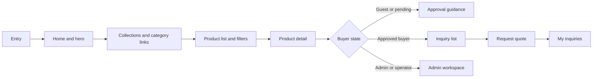
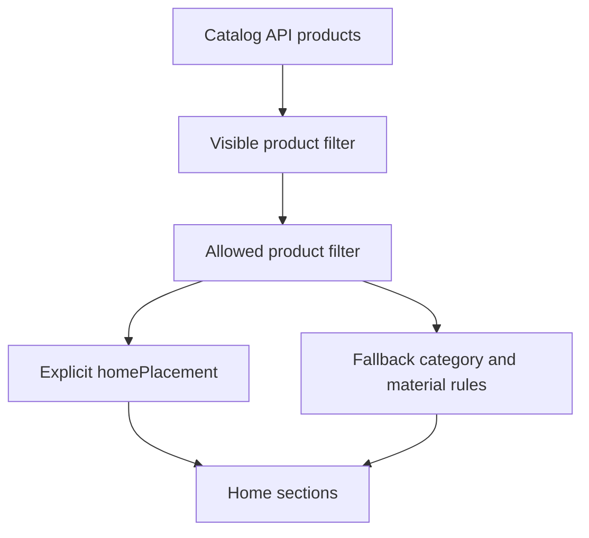
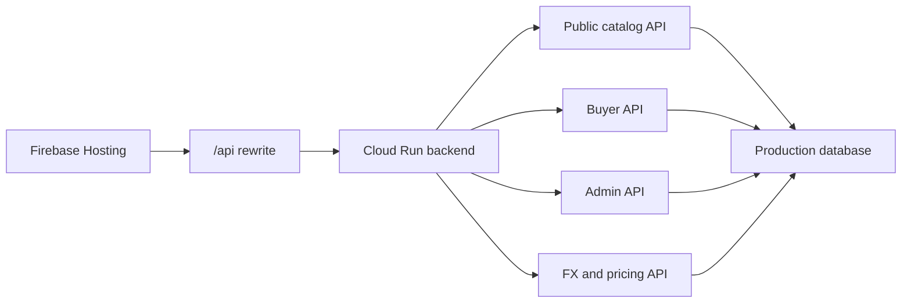

# Noblesse Site Operations Map

Date: 2026-07-08

Scope: read-only production route, source, and API mapping for the Noblesse B2B catalog.

Production site: `https://noblesse.web.app`

Repository baseline:

| Item | Value |
| --- | --- |
| Workspace | `D:\noblesse-main-work` |
| Branch | `main` |
| Baseline HEAD | `81c5d80f0a2daf0dc9bf091b46e107d4b89ec1d3` |
| Production backend | `/api/**` rewrite to Noblesse backend |
| Canonical Taiwan locale | `zh-TW` |

## Product Identity

Noblesse is a premium B2B piercing catalog. The site must remain a quote-request and buyer-approval workflow, not a direct purchase store.

Approved terminology:

| English | Korean |
| --- | --- |
| Inquiry List | 견적 리스트 |
| Request Quote | 견적 요청 |
| My Inquiries | 내 견적 요청 |
| Buyer Approval | 거래처 승인 |
| Price available after approval | 승인 후 가격 확인 가능 |

Avoid direct-purchase language in user-facing UI.

## High-Level User Flow

## Locale and Route Structure

The app supports root routes and locale-prefixed routes. `cn` currently resolves to the Taiwan Chinese route family.

| Route family | Purpose | Status |
| --- | --- | --- |
| `/`, `/kr`, `/en`, `/jp`, `/zh-TW` | Home | Operational |
| `/cn` | Legacy Taiwan Chinese entry | Canonicalizes to `zh-TW` |
| `/products` and `/:locale/products` | Product list | Operational |
| `/products/:productId` and `/:locale/products/:productId` | Product detail | Operational |
| `/register` and `/:locale/register` | Buyer registration | Operational |
| `/account` and `/:locale/account` | Account status | Operational |
| `/inquiry-list` and `/:locale/inquiry-list` | Inquiry list | Operational for approved flow |
| `/request-quote` and `/:locale/request-quote` | Quote request | Operational path exists |
| `/my-inquiries` and `/:locale/my-inquiries` | Buyer inquiry history | Operational path exists |
| `/admin` and `/:locale/admin` | Admin dashboard | Protected |
| `/:locale/admin/catalog/new` | Guided product entry | Protected |
| `/:locale/admin/buyers` | Member and buyer review | Protected |
| `/:locale/admin/inquiries` | Inquiry management | Protected |
| `/:locale/admin/quotes` | Quote management | Protected |
| `/:locale/admin/prices` | Manual pricing | Protected |
| `/:locale/admin/fx` | Automatic FX pricing | Protected |
| `/:locale/admin/team` | Operator management | Protected |

Legacy redirects remain aligned with B2B terminology:

| Old route | Target |
| --- | --- |
| `/cart` | `/inquiry-list` |
| `/order-request` | `/request-quote` |
| `/orders` | `/my-inquiries` |
| `/orders/:orderId` | `/my-inquiries/:inquiryId` |

## Home Page Operations Map

Home is composed from public catalog data plus placement rules.

| Home area | Source | Current behavior | Admin gap |
| --- | --- | --- | --- |
| Snap / hero cards | Product and curated image data | Visible on production | Needs explicit admin editorial controls |
| Quick category chips | Frontend category/filter config | Visible | Needs server-backed management if operations require live edits |
| New arrivals | `homePlacement.showInNewArrivals` fallback to visible allowed products | Operational | Needs cleaner empty/disabled state controls |
| Weekly pick | `homePlacement.showInWeeklyPick` fallback to best products | Operational | Needs admin-managed placement and enable/disable |
| Buyer selection | Placement / collection logic | Operational but may be sparse | Needs admin-managed placement |
| Piercing | Piercing category or explicit placement | Operational | Needs taxonomy cleanup |
| Steady selection | Silver or steady collection logic | Operational | Needs admin-managed placement |

Home product selection logic is implemented in `src/services/homePlacement.js`.

## Product List and Filter Map

| Area | Current source | Status | Notes |
| --- | --- | --- | --- |
| Product list | `/api/catalog/products` | Operational | Production currently returns one public seeded product |
| Category and taxonomy routes | React Router plus product taxonomy fields | Partial | Needs stronger taxonomy editor and coverage |
| Filter labels | Frontend config and locale copy | Partial | Requires admin-backed filter option management |
| Empty result state | Frontend UI | Operational | Should remain non-mutating |
| Search | Frontend route and product text matching | Partial | Needs search relevance audit |

Current public seeded product observed through API:

| Field | Evidence |
| --- | --- |
| Public product count | 1 |
| Product id/code route | `NB-4WAY-GREEN-CLOVER-BARBELL` |
| Image set | Present |
| Home placement metadata | Present |

## Product Detail Operations Map

| Detail area | Current behavior | Operational note |
| --- | --- | --- |
| Product image | Uses product `imageSet` | Present for the seeded product |
| Product title and code | Uses catalog API product fields | Present |
| Approval price panel | Shows approval-based guidance for guest/pending | Must not reveal approved buyer pricing to unapproved users |
| Detail sections | Editorial/specification/material/quote sections | Present, but typography and long-locale layout need polish |
| Related products | Category-related area exists | Sparse because only one public product exists |

Detail page source: `src/pages/ProductDetailPage.jsx`.

Key constraint: Product detail must stay quote-request focused. It must not introduce direct checkout behavior.

## Registration and Account Map

| Area | Status | Notes |
| --- | --- | --- |
| Terms and agreements | Operational | Korean structure is the reference; other locales need parity checks |
| Buyer registration | Operational route | Uses backend buyer registration API |
| Login identifier | Supports identifier resolution flow | Must keep safe, non-leaking errors |
| Account page | Operational | Admin and buyer states are displayed by role/status |

## Admin Operations Map

Admin shell source: `src/components/AdminShell.jsx`.

| Admin menu | Route | Permission | Current role |
| --- | --- | --- | --- |
| Dashboard | `/admin` | `dashboard.read` | Summary and work queue |
| Members / Buyers | `/admin/buyers` | `buyers.read` | Buyer review and status management |
| Inquiries | `/admin/inquiries` | `inquiries.read` | Inquiry review |
| Quotes | `/admin/quotes` | `quotes.read` | Quote management |
| New product | `/admin/catalog/new` | `catalog.write` | Guided product entry |
| Products | `/admin/products` | `catalog.read` | Product list and visibility |
| Categories | `/admin/categories` | `catalog.read` | Category management |
| Prices | `/admin/prices` | `prices.read` | Manual price management |
| Automatic FX prices | `/admin/fx` | `prices.read` | FX rate and draft workflow |
| Analytics | `/admin/analytics` | `analytics.read` | Operational insight |
| Team | `/admin/team` | `admins.read` | Operator and permission management |
| Audit | `/admin/audit` | `audit.read` | Activity log |

## Admin Permission Model

Permission catalog source: `src/constants/adminPermissionCatalog.js`.

| Domain | Permissions |
| --- | --- |
| Dashboard | `dashboard.read` |
| Buyers | `buyers.read`, `buyers.sensitive.read`, `buyers.review`, `buyers.suspend` |
| Inquiries | `inquiries.read`, `inquiries.manage` |
| Catalog | `catalog.read`, `catalog.write`, `catalog.publish` |
| Prices | `prices.read`, `prices.write` |
| Quotes | `quotes.read`, `quotes.write` |
| Analytics | `analytics.read` |
| Admins | `admins.read` |
| Audit | `audit.read` |

## API Map

API base: `https://noblesse.web.app/api`

| API area | Routes | Read-only smoke result |
| --- | --- | --- |
| Health | `GET /health` | 200 |
| Public catalog | `GET /catalog/products` | 200 |
| Product detail | `GET /catalog/products/:code` | 200 for seeded product |
| Missing product | `GET /catalog/products/:code` | 404 for nonexistent product |
| Buyer profile | `GET /buyer/me` | 401 without authentication |
| Admin profile | `GET /admin/me` | 401 without authentication |
| Login identifier | `POST /auth/resolve-login-identifier` | 401 for unauthenticated smoke input |

## Data Model Status

| Model | Status | Notes |
| --- | --- | --- |
| User | Operational | Role and account lifecycle exist |
| Buyer profile | Operational | Verification/status lifecycle exists |
| Admin/operator | Operational | Permission-based admin shell exists |
| Product | Operational | One production product is public |
| Category | Operational | Admin route exists |
| Product image | Operational | Image metadata is present |
| Price book | Operational | Admin route exists |
| FX snapshot/run | Operational | FX route and automation exist |
| Product attributes | Partial | Needs stronger editing and detail coverage |
| Product options | Partial | Needs size/color/material variant structure cleanup |
| Inquiry | Partial/operational | Buyer and admin routes exist |
| Quote | Partial/operational | Admin quote route exists |
| Direct settlement | Out of scope | Should not be added to current B2B catalog flow |

## Operations Boundary

This audit did not perform:

- Production data mutation
- Product creation or update
- Buyer approval or status change
- Manual FX execution
- Scheduler changes
- Cloud runtime changes
- Database migration
- Deployment
